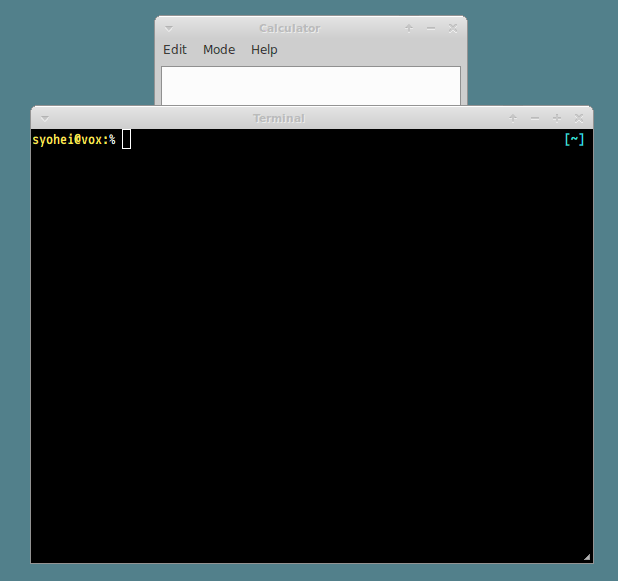
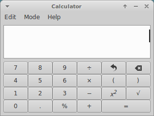
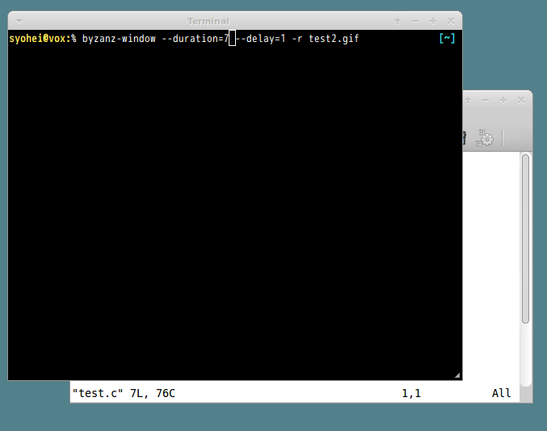
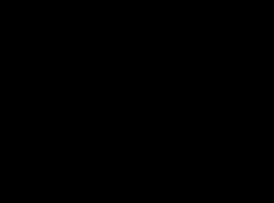

# byzanz-window.go

This is Go port of [byzanz_window.py](https://gist.github.com/noamraph/8348560).
It is very nice python script however it does not work with Python 3.4.
So I port it in Go language.

## Installation

```
% go get github.com/syohex/byzanz-window/cmd/byzanz-window
```

You can also install binary from [here](https://github.com/syohex/byzanz-window/releases).

## Requirement Packages

### Ubuntu
- byzanz
- xdotool
- x11-utils(`xprop`, `xwininfo`)

```
% sudo apt install byzanz xdotool x11-utils
```

### Fedora
- byzanz
- xdotool
- xorg-x11-utils

```
% sudo yum install byzanz xdotool xorg-x11-utils
```

## Example

```
% byzanz-window --duration=30 --delay=5 --cursor output.gif
```

## Options

Some option names are changed from original ones.

|option          |Description                     |Default |
|----------------|--------------------------------|--------|
|-d, --duration  |Record seconds                  |10      |
|--delay         |Delay seconds before recording  |1       |
|-c, --cursor    |Record mouse cursor             |false   |
|-a, --audio     |Record audio                    |false   |
|-r, --rectangle |Record in rectangle(Linux Only) |false   |

zsh completion is [here](https://github.com/syohex/zsh-go-completions/blob/master/_byzanz-window)

## Recording Steps

### 1. Execute `byzanz-window`

```
# Record 20 seconds
% byzanz-window --duration=20 --delay=5 --cursor output.gif
```

### 2. Select Window

### 3. Start recording

You type **Return** key, then recording starts after `--delay` second(Default: 1 second).

### 4. Gif is generated

After `--duration` seconds(Default: 10 seconds), Gif file is generated.

Have fun!!


## Window Capture

```
% byzanz-window --duration=seconds --delay=seconds output-file.gif
```



Generated gif is




## Rectangle Capture

```
% byzanz-window --rectangle --duration=seconds --delay=seconds output-file.gif # with '--rectangle' option
```



Generated gif is


