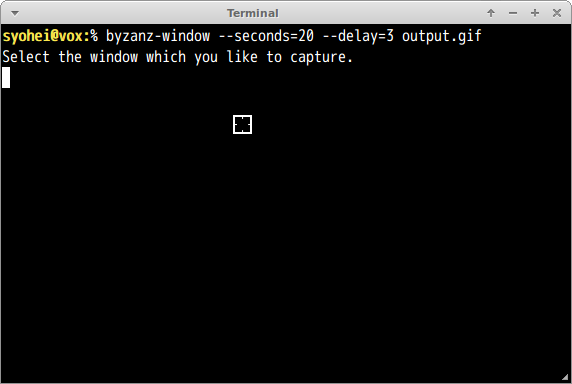

# byzanz-window.go

This is Go port of [byzanz_window.py](https://gist.github.com/noamraph/8348560).
It is very nice python script however it does not work with Python 3.4.
So I port it in Go language.

## Installation

```
% go get github.com/syohex/byzanz-window
```

## Requirement Packages

Ubuntu
- byzanz
- xdotool
- x11-utils(`xprop`, `xwininfo`)

## Example

```
% byzanz-window --second 30 --delay 5 --cursor output.gif
```

## Options

Some option names are changed from original ones.

|option       |Description         |Default |
|-------------|--------------------|--------|
|-s, --second |Record seconds      |10      |
|-d, --delay  |Delay before start  |1       |
|-c, --cursor |Record mouse cursor |false   |
|-a, --audio  |Record audio        |false   |

## Recording Steps

### 1. Execute `byzanz-window`

```
# Record 20 seconds
% byzanz-window --second 20 --delay 5 --cursor output.gif
```

### 2. Select Window



### 3. Start recording

You type **Return** key, then recording starts after `--delay` second(Default: 1 second).

### 4. Gif is generated

After `--seconds` seconds(Default: 10 seconds), Gif file is generated.

Have fun!!
